# Beer-Tag Web Application

A web application with REST API for users to create and manager their own beers, as well as rate them, add them to wish & tasted-lists, and browse through all beers created by other users, and also use filtering & sorting. Users can edit or delete the beers they`ve created, as well as edit or delete their own profile. There is an admin role, which has its own Admin panel, which can edit or delete all beers and users.

***I would be happy to provide the code base upon request.***

### Used back-end technologies:
* Java
* Spring Boot with Spring MVC and Spring Security
* Thymeleaf
* Hibernate
* SQL & MariaDB

### Used front-end technologies:
* HTML
* CSS
* jQuery
* JavaScript

### Link to video:

### Screenshots:

#### Home page:
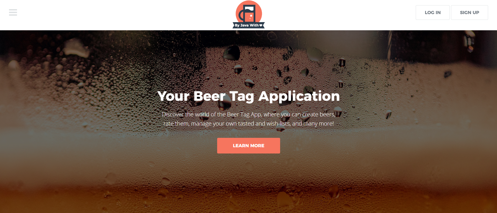
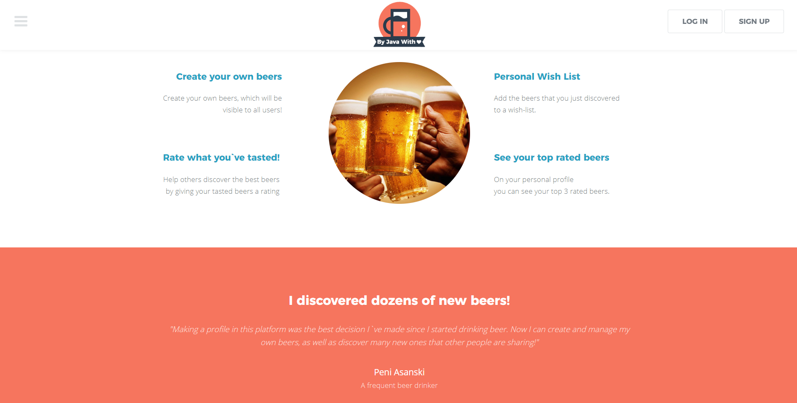
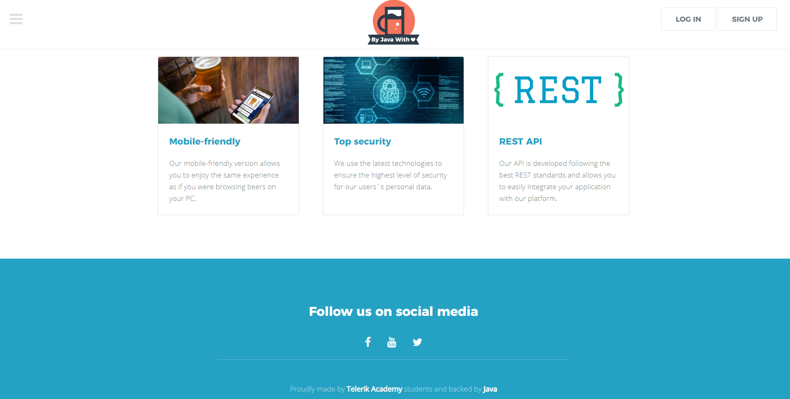

#### Beers list - filtering and sorting:
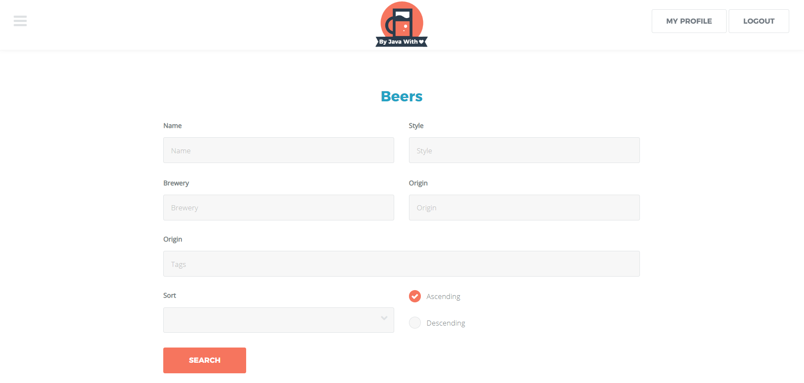
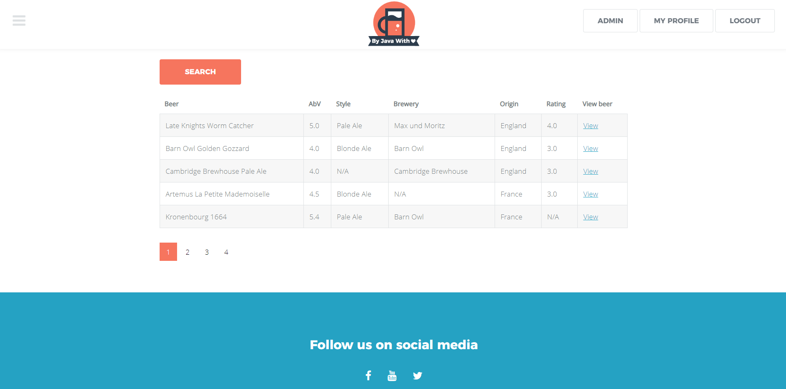

#### Create a new beer & beer profile:
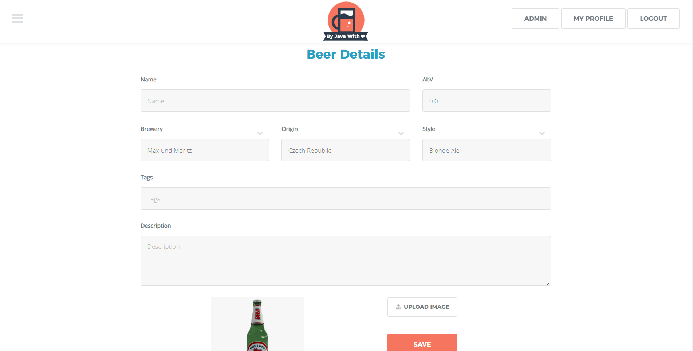
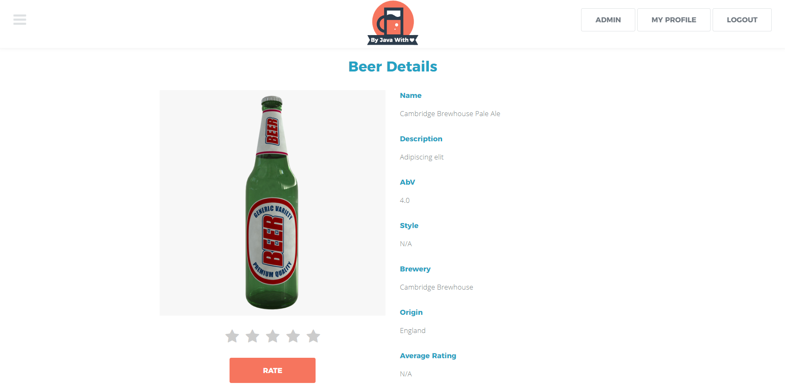
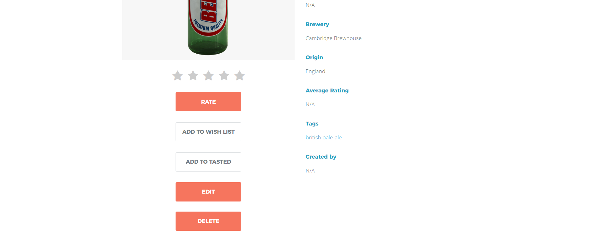

#### Signup form:
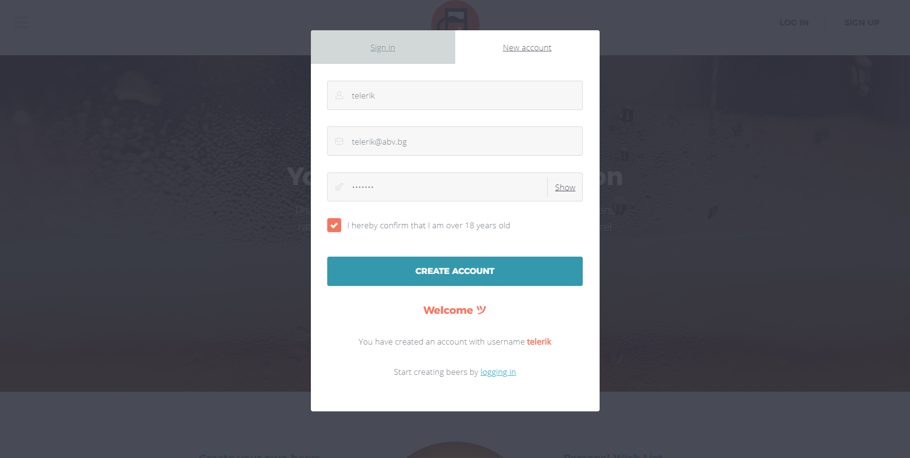
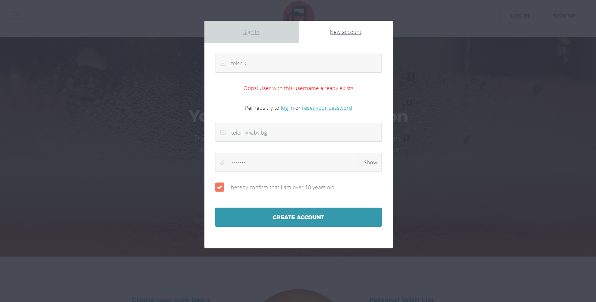

#### Main menu navigation:
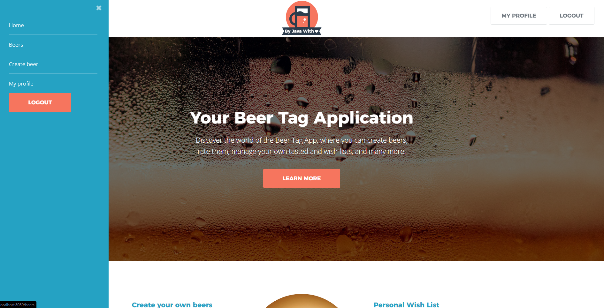

### User profile & edit user:
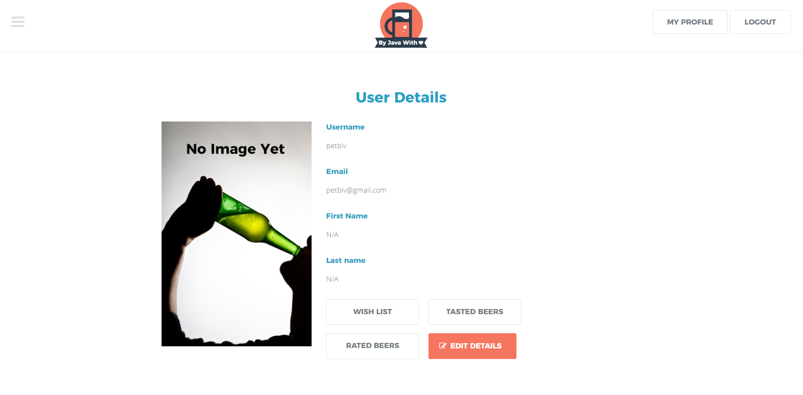
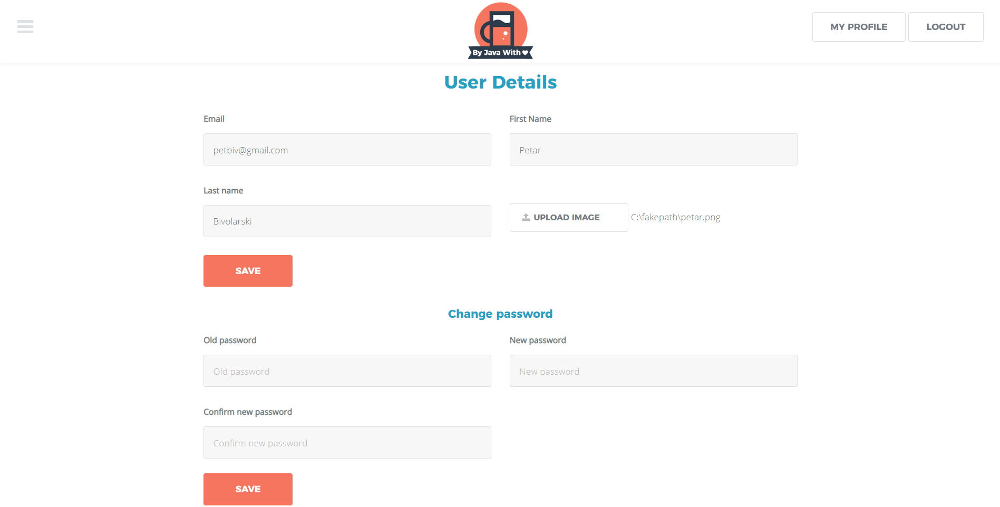
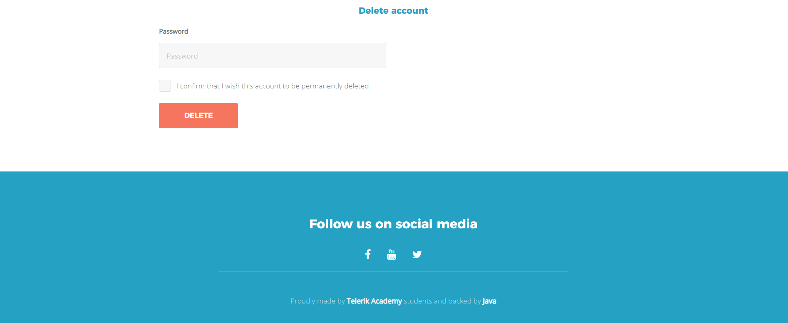
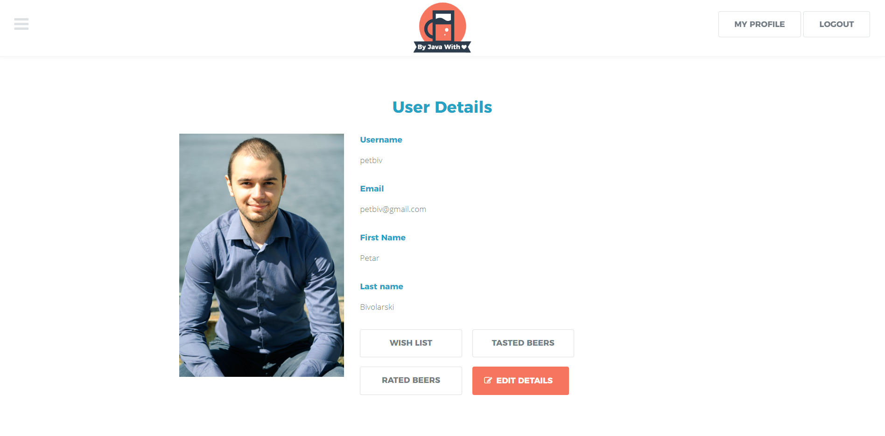

### Admin page & admin user list
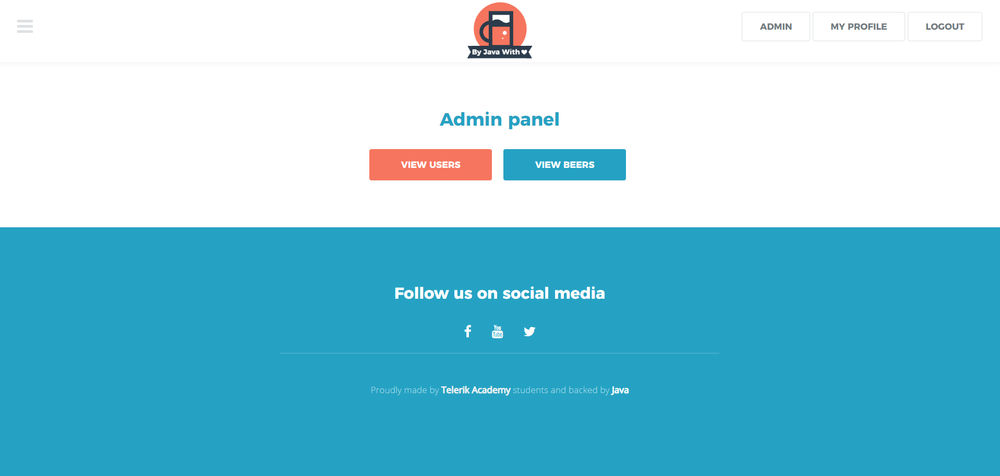
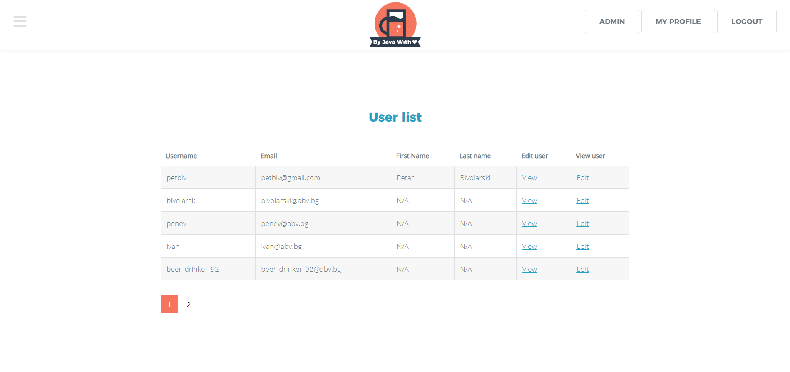

